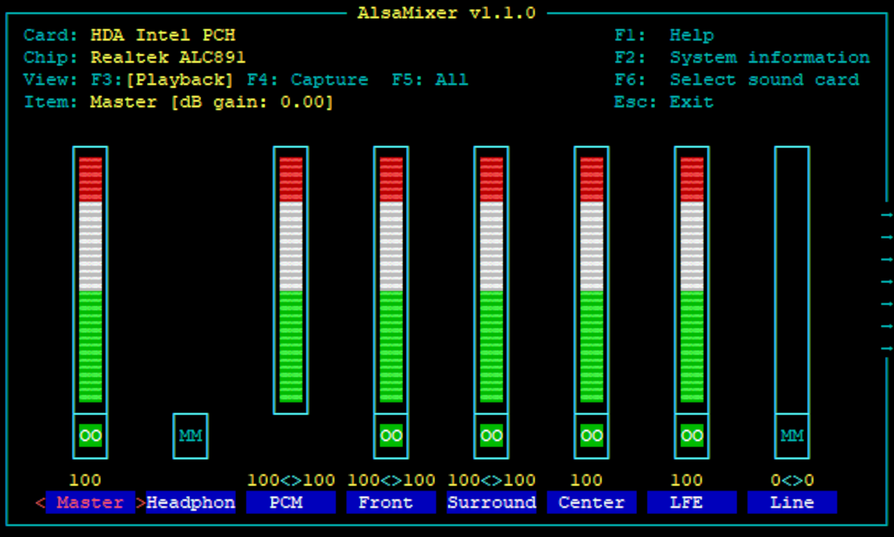

# alsamixer

The Advanced Linux Sound Architecture (ALSA) provides kernel driven sound card drivers. It replaces the original Open Sound System (OSS). 

## Usage

Just write to following command to terminal

,,,
alsamixer
,,,

## References
1. <https://wiki.archlinux.org/title/Advanced_Linux_Sound_Architecture>
