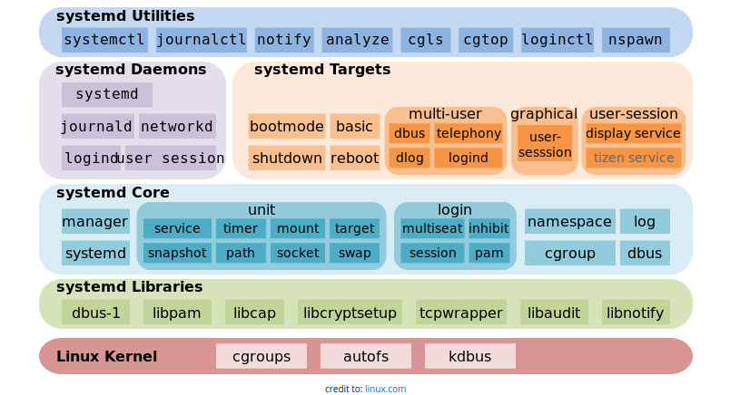

# systemctl command 

The systemctl command manages both system and service configurations, enabling administrators to manage the OS and control the status of services. Further, systemctl is useful for troubleshooting and basic performance tuning.

## References
1. <https://www.liquidweb.com/kb/what-is-systemctl-an-in-depth-overview/>